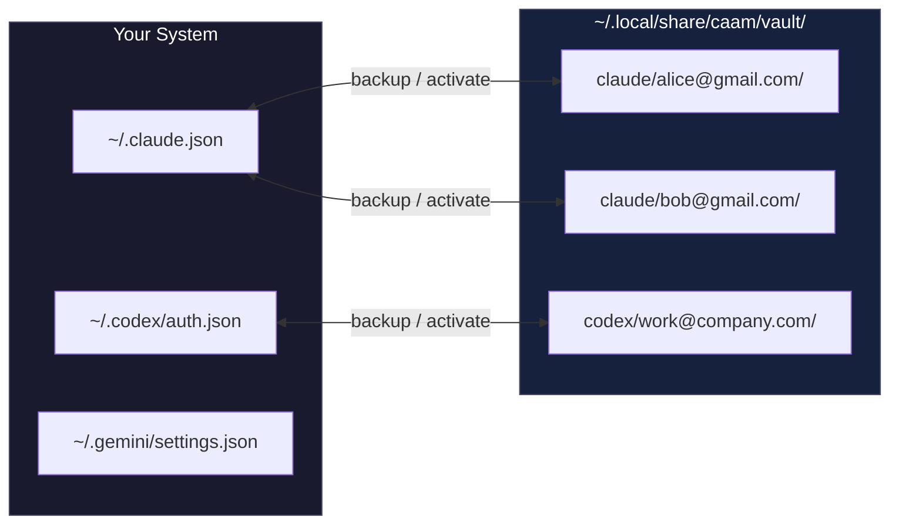

<p align="center">
  
</p>

# caam - Coding Agent Account Manager


> **Sub-100ms account switching for AI coding CLIs with fixed-cost subscription plans. When you hit usage limits on Claude Max, GPT Pro, or Gemini Ultra, don't wait 60 seconds for browser OAuth—just swap to another account instantly.**

```bash
curl -fsSL "https://raw.githubusercontent.com/Dicklesworthstone/coding_agent_account_manager/main/install.sh?$(date +%s)" | bash
```

Usage:

```bash
caam backup claude alice@gmail.com      # Save current auth
caam activate claude bob@gmail.com      # Switch instantly
```

---

## 🤖 Agent Quickstart (JSON)

**Use `--json` in agent contexts.** stdout = data, stderr = diagnostics, exit 0 = success.

```bash
# List available profiles (machine-readable)
caam list --json

# Show current status for all tools
caam status --json

# Switch accounts
caam activate claude alice@gmail.com --json
```

The `robot` commands emit JSON without a `--json` flag:

```bash
caam robot validate claude work        # Check saved credentials locally
caam robot precheck claude             # Plan a session from usable profiles
caam robot act activate claude work    # Install the selected credentials
caam robot act refresh codex work      # Refresh through CAAM when supported
```

`validate` and `robot validate` share the same passive assessment. A Claude
snapshot containing only account labels or ordinary settings is invalid;
missing, incomplete, null, or malformed credentials cannot become valid merely
because their expiry is unknown. Activation checks the snapshot before changing
live credentials or settings. Genuine opaque credentials can have unknown expiry,
and an expired access token remains eligible when its credential is renewable
and has not been rejected by the provider.

Robot `next` and `precheck` exclude unusable credentials and system snapshots.
`--include-cooldown` only relaxes the cooldown filter. An unnamed robot backup
creates an `_backup_*` snapshot without replacing a matching named account as
the active profile. A failed validation or a precheck with no usable account
returns `success: false` and a nonzero exit status.

Passive validation does not prove provider acceptance. `--active` explicitly
fails for saved vault profiles. Robot refresh reports `REFRESH_UNSUPPORTED`
when renewal belongs to the native CLI or requires a new login, and
`REFRESH_SKIPPED` when a stale snapshot cannot safely be refreshed. Neither
outcome claims that credentials were renewed.

---

## The Problem

You're paying $200-275/month for fixed-cost AI coding subscriptions (Claude Max, GPT Pro, Gemini Ultra). These plans have usage limits—not billing caps, but rate limits that reset over time. When you hit them mid-flow, the official way to switch accounts:

```
/login → browser opens → sign out of Google → sign into different Google →
authorize app → wait for redirect → back to terminal
```

**That's 30-60 seconds of friction.** Multiply by 5+ switches per day across multiple tools.

## The Solution

Each AI CLI stores OAuth tokens in plain files. `caam` backs them up and restores them:

```bash
caam activate claude bob@gmail.com   # ~50ms, done
```

No browser. No OAuth dance. No interruption to your flow state.

---

## How It Works



**That's it.** No external database servers (uses embedded SQLite), no required daemons (optional background service available). Just `cp` with extra steps.

### Why This Works

OAuth tokens are bearer tokens—possession equals access. The CLI tools don't fingerprint your machine beyond what's already in the token file. Swapping files is equivalent to "being" that authenticated session.

### Profile Detection

`caam status` uses **content hashing** to detect the active profile:

1. SHA-256 hash current auth files
2. Compare against all vault profiles
3. Match = that's what's active

This means:
- Profiles are detected even if you switched manually
- No hidden state files that can desync
- Works correctly after reboots

---

## Three Operating Modes

### 1. Vault Profiles (Simple Switching)

Swap auth files in place. One account active at a time per tool. Instant switching.

```bash
caam backup claude work@company.com
caam activate claude personal@gmail.com
```

**Use when:** You want to switch between accounts sequentially (most common use case).

### 2. Isolated Profiles (Parallel Sessions)

Run multiple accounts **simultaneously** with full directory isolation.

```bash
caam profile add codex work@company.com
caam profile add codex personal@gmail.com
caam exec codex work@company.com -- "implement feature X"
caam exec codex personal@gmail.com -- "review code"
```

Each profile gets its own `$HOME` and `$CODEX_HOME` with symlinks to your real `.ssh`, `.gitconfig`, etc.

**What is and isn't isolated inside a profile:**

| Path | Treatment | Why |
|---|---|---|
| Provider auth dirs (`~/.claude` credentials, `~/.config/claude-code`, `$CODEX_HOME`, `~/.gemini`, `~/.config/opencode`, ...) | isolated (real dirs) | The whole point: per-account credentials. |
| `~/.ssh`, `~/.gitconfig`, `~/.gnupg`, `~/.aws`, `~/.cargo`, `~/.npm`, `~/.local/bin` | symlink → real home | Dev tooling passes through. |
| Other `$XDG_CONFIG_HOME` entries (`gh`, `atuin`, `uv`, `shopify-*`, ...) | per-entry symlink → real `~/.config` | XDG-based CLIs keep their credentials — without this, `gh` silently logs out and `git push` fails with `could not read Username for 'https://github.com'` (issue #69). |
| Other `~/.local/share` and `~/.local/state` entries (`com.vercel.cli`, `supabase`, ...) | per-entry symlink → real home | Same: `HOME` redirection silently relocates the XDG data/state dirs. |
| `~/.local/share/caam` | never passed through | Contains the vault and every profile's credentials. |
| Claude `~/.claude/skills`, `plugins`, `commands`, `agents` | symlink → real home, in both `home/.claude` and `$CLAUDE_CONFIG_DIR` (`xdg_config/claude-code`) | User tooling, not account state — shared so sessions inside a profile keep their skills. XDG-aware Claude Code reads them only from `CLAUDE_CONFIG_DIR` (issue #90). |

Passthrough symlinks (and the Claude asset links) are refreshed on every `caam exec`, so tools installed after profile creation are picked up automatically.

**Use when:** You need two accounts running at the same time in different terminals.

### 3. Shallow Profiles (Concurrent Multi-Account Multiplexing)

A "shallow" `$HOME` per identity: only the auth-bearing files are real, **everything else is a symlink back to your real `~/`**. Designed for orchestrators that fan N parallel agent sessions across N accounts on the same machine.

**Supported providers:** `claude`, `codex`, and `agy` (Antigravity). Each provider keeps only *its own* identity files real and private; everything else symlinks back to your real `~/`. The provider is inferred from `--from-vault <tool>/<profile>`, or set explicitly with `--tool claude|codex|agy` (defaults to `claude`). On spawn, caam repoints `HOME` at the shallow profile and pins the provider's home var (`CODEX_HOME` / `GEMINI_HOME`) so a stray inherited value can't pull the real identity back in.

```bash
# Stage credentials in caam's vault first (one-time per account).
caam backup claude alice@example.com
caam backup codex  bob
caam backup agy    carol

# Create a shallow profile per identity, copying the credential out of the vault.
# --tool is inferred from the <tool>/<profile> part of --from-vault.
caam shallow-profile create alice --from-vault claude/alice@example.com
caam shallow-profile create bob   --from-vault codex/bob
caam shallow-profile create carol --from-vault agy/carol

# Spawn concurrent sessions, each pinned to its own identity and provider.
# With no `-- <cmd>` the profile's own CLI (claude / codex / agy) is run.
caam shallow-spawn alice &   # session 1, alice's Claude quota
caam shallow-spawn bob   &   # session 2, bob's Codex identity
caam shallow-spawn carol &   # session 3, carol's Antigravity identity
wait
```

Layout under `~/orch-homes/<name>/` — **claude** (the `codex` and `agy` real-file sets are listed below):

| Path | Real or symlink? | Why |
|------|------------------|-----|
| `.claude/.credentials.json` | **real file** | The whole point: per-identity OAuth token. |
| `.claude/.credentials.lock` | **real file** | Per-identity flock target so two sessions don't serialize on a shared lock. |
| `.claude/settings.json` | **real file** | Workflow policy is refreshed from the canonical user settings; API-key helpers and credential environment remain private to this account. Existing links to the user's settings are converted to private files before launch. |
| `.claude.json` | **real file** | Claude Code rewrites this on every run (it holds the login identity); a symlink would mutate the user's real settings under the shallow identity. Seeded from your real `~/.claude.json` minus the account-bound keys (`oauthAccount`, usage/entitlement caches), and the shared preference keys (theme, editor mode, notification channel, user/project `mcpServers`, project trust and `allowedTools`) are refreshed from the real file on every `shallow-spawn` — the main lane is the source of truth for configuration; pass `--no-sync-config` to keep a profile's own values. |
| `.claude/projects/`, `.claude/todos/`, `.claude/shell-snapshots/` | symlink → `~/.claude/...` | Conversation history is shared. |
| `.bashrc`, `.zshrc`, `.gitconfig`, `.ssh/`, `.cargo/`, `.bun/`, `.config/`, `.docker/`, ... | symlink → `~/...` | Dev tooling, shell, git, ssh — all pass through. |

Per-provider real (private) files — everything else under the provider's home is symlinked through, so non-auth state (sessions, history, caches) stays shared:

| Provider | Real / private files | Spawn pins |
|----------|----------------------|------------|
| `claude` | `.claude/.credentials.json`, `.claude/.credentials.lock`, `.claude.json` | (none; `$HOME/.claude` is the config dir) |
| `codex`  | `.codex/auth.json`, `.codex/config.toml` (file credential store enforced; shared tables refreshed from your real config on every spawn, hook/project/notice state kept private) | `CODEX_HOME=<profile>/.codex` |
| `agy`    | `.gemini/antigravity-cli/antigravity-oauth-token` (+ optional `.gemini/google_accounts.json`, `.gemini/oauth_creds.json`, `.gemini/antigravity-cli/settings.json`) | `GEMINI_HOME=<profile>/.gemini` |

Every shallow spawn, whatever its provider, scrubs every inherited provider-home override (`CLAUDE_CONFIG_DIR`, `CODEX_HOME`, `GEMINI_HOME`) plus `CAAM_HOME`/`XDG_DATA_HOME` before applying its own pins, so a shallow session started from inside another shallow session cannot inherit the outer profile's identity (issue #106).

**Smart fallback:** if a candidate (e.g. `~/.cargo`) doesn't exist in your real `~/`, no symlink is created — no broken links for users who don't have a given tool installed.

**Use when:** Your orchestrator runs N Claude Code sessions in parallel and each one must hit a different account simultaneously. `caam profile add` would also work, but each profile gets a blank shell history, blank git config, and blank Claude conversation history — painful for real dev work. Shallow profiles preserve everything you'd want to share and isolate only the auth identity.

**Subcommands:**

```bash
caam shallow-profile create <name> [--tool claude|codex|agy] [--from-vault <tool>/<profile>] [--from-file <path>] [--force] [--json]
caam shallow-profile list [--json]
caam shallow-profile delete <name> [--force] [--json]
caam shallow-profile sync-config <name>|--all [--json]   # reconcile shared config with your real HOME
caam shallow-spawn <name>                     # open the profile's own provider CLI (claude / codex / agy) in this terminal
caam shallow-spawn <name> --create            # first run of a NEW identity: provision an empty profile, then start it
caam shallow-spawn <name> --create --tool codex   # ...with a codex layout instead of claude
caam shallow-spawn <name> -- <cmd> [args...]  # or run any other command under the profile
caam shallow-spawn <name> --print-env         # print HOME=... (and CODEX_HOME/GEMINI_HOME) without exec
caam shallow-spawn <name> --allow-agent-view -- claude   # keep Claude Code Agent View enabled (see note below)
caam shallow-spawn <name> --no-sync-config    # don't refresh shared config from your real HOME before starting
caam shallow-profile sync-config <name>       # ...or reconcile it on demand (--all for every profile)
caam shallow-spawn <name> --effort xhigh -- codex ...    # codex only: injects `-c model_reasoning_effort=xhigh` (codex has no --effort flag)
```

The base directory defaults to `~/orch-homes/`. Override with `$CAAM_SHALLOW_HOMES_DIR` or the `--base` flag (per-command, useful for tests).

**Worked example — 3-way Claude orchestration on a VPS:**

```bash
# One-time setup: log in once on each account through the normal Claude flow,
# back each one up to caam's vault.
for who in alice bob charlie; do
  /login                                # in claude → $who's google account
  caam backup claude "$who"
done

# Create three shallow identities pointing at those vault profiles.
for who in alice bob charlie; do
  caam shallow-profile create "$who" --from-vault "claude/$who"
done

# Fan three concurrent claude sessions. Each lands on its own quota,
# but all three share your real ~/.bashrc, ~/.gitconfig, ~/.ssh, AND
# ~/.claude/projects (so any session can see/resume any conversation).
caam shallow-spawn alice   -- claude --print "audit pkg/auth for race conditions"   &
caam shallow-spawn bob     -- claude --print "write tests for internal/shallow"     &
caam shallow-spawn charlie -- claude --print "draft release notes for v0.4.0"       &
wait
```

#### Starting a new identity: `--create`

An unknown name is an **error**, not a new profile. Creating implicitly would
turn `caam shallow-spawn alise` into a fresh empty identity plus a login prompt
for the wrong account, with the mistyped profile then lingering on disk. The
error instead names the closest existing profile and the flag that would have
created this one:

```
shallow profile "alise" does not exist; did you mean "alice"?
  create it and start a session:  caam shallow-spawn alise --create [--tool claude|codex|agy]
  or set it up explicitly:        caam shallow-profile create alise
```

`--create` provisions the profile with **empty** credentials and starts the
session, so the first run of a new identity is a login prompt. Credentials are
deliberately never copied from the vault here: two homes sharing one
refresh-token family invalidate each other, so seeding stays an explicit
`caam shallow-profile create --from-vault <tool>/<profile>` decision.
`--print-env` remains a strict dry run and never creates anything, and `--tool`
on a profile that already exists under another provider is an error rather than
a silent no-op.

#### Keeping shared configuration in sync

A shallow profile's provider configuration is a *real*, private file — it has
to be, because the provider writes identity and per-home state into it — so it
diverges from your real HOME the moment you change something there. The most
common casualty is an MCP server: change a real-home entry from the stdio
transport to streamable HTTP and every codex profile keeps the old
`command`/`args` block, after which codex refuses to parse its config at all
(`url is not supported for stdio in mcp_servers.<name>`).

Every spawn therefore refreshes the shared configuration from your real HOME,
and `caam shallow-profile sync-config <name> [--all]` does it on demand:

| Provider | Refreshed | Never touched |
|----------|-----------|---------------|
| claude (`.claude/settings.json`) | Shared workflow policy, including permissions, hooks, MCP configuration and explicitly shared environment keys | Account helpers, credential environment and `profile_keys` overrides |
| claude (`.claude.json`) | preferences (theme, editor mode, notification channel, auto-updates), user-scope `mcpServers`, per-project trust / `allowedTools` / MCP settings | `oauthAccount`, usage caches, prompt history, per-project session state |
| codex (`.codex/config.toml`) | root settings (`model`, `model_reasoning_effort`, `personality`, `notify`, …) and whole tables: `[mcp_servers.*]`, `[features]`, `[skills]`, `[hooks]`, `[model_providers.*]` | `[hooks.state.*]` (hook trust), `[projects.*]` (workspace trust), `[notice.*]` (dismissed notices), and `auth.json` |

The providers preserve their respective configuration formats:

- **Sections are replaced as a unit, never merged key by key.** For an MCP
  server that is the whole point: `[mcp_servers.kernel]` and its subtables are
  dropped and re-inserted together, so a stale `command`/`args` pair cannot
  survive beside a new `url`.
- **Claude removals propagate.** An existing canonical document is authoritative
  for shared policy. Removed permissions, MCP entries and project approvals are
  removed from the profile too. A missing canonical file preserves the profile's
  policy, and account and runtime state remain private.
- **Codex retains profile-only tables.** A table your profile has and your real
  HOME does not is left alone; the real side wins where it defines a setting.

`cli_auth_credentials_store = "file"` is re-enforced on every codex sync, so a
profile can never be talked into a shared keychain. Codex uses structural edits
that preserve comments, key order and formatting; Claude writes private JSON
documents. A second sync writes nothing. Pass `--no-sync-config` to skip policy
refresh. Claude settings must still be valid and private: old links to host
settings are detached even with this flag, and preparation failures stop the
launch. `--print-env` stays read-only.

> **Claude Agent View is disabled by default in shallow sessions (issue #49).** Claude Code's Agent View feature (the `--bg` background-supervisor daemon) runs a **long-lived, cross-session** supervisor process that is **not** bound to the shallow profile's `HOME`. On resume, a shallow `claude` session would reconnect to an already-running supervisor bound to a *different* identity (typically the VM's primary Claude auth), silently bypassing shallow-spawn's per-identity auth isolation and using the wrong account. caam cannot control that daemon's lifecycle, so `caam shallow-spawn <name> -- claude` injects `CLAUDE_CODE_DISABLE_AGENT_VIEW=1` into the child environment by default. This keeps the session foreground and honoring the per-identity `~/.claude/.credentials.json`.
>
> **Escape hatches** (both opt back into Agent View, accepting the auth-isolation caveat above):
> - Pass `--allow-agent-view` on `shallow-spawn` — caam will not inject the disable flag for that invocation.
> - Export `CLAUDE_CODE_DISABLE_AGENT_VIEW` yourself (to any value) before spawning — caam never overrides an explicit user setting.
>
> This only affects the `claude` provider; `codex` and `agy` shallow sessions have no Agent View feature and are unchanged.

> **Note:** `caam shallow-profile` does not (yet) call any reverse-engineered Anthropic endpoints to display per-account live usage data. That's a separate concern tracked in the original report (issue #16) and intentionally deferred.

---

## Supported Tools

| Tool | Auth Location | Login Command |
|------|--------------|---------------|
| **Claude Code** | OAuth: `~/.claude/.credentials.json` + `~/.claude.json` + `~/.config/claude-code/auth.json` + (macOS) `~/Library/Application Support/Claude/config.json` • API key: `~/.claude/settings.json` | `/login` in CLI |
| **Codex CLI** | `~/.codex/auth.json` (file store enforced) | `codex login` (or `--device-auth`) |
| **Antigravity CLI** | OAuth: `~/.gemini/antigravity-cli/antigravity-oauth-token` (+ `~/.gemini/google_accounts.json`) | `agy` interactive (Google OAuth) |
| **Gemini CLI** (legacy) | OAuth: `~/.gemini/settings.json` (+ `oauth_creds.json`) • API key: `~/.gemini/.env` | `gemini` interactive |
| **Grok Build** (xAI) | OAuth/OIDC: `~/.grok/auth.json` (+ `~/.grok/config.toml`); respects `GROK_HOME` | `grok login` (browser OIDC) |

### Claude Code (Claude Max)

**Subscription:** Claude Max ($200/month)

**Auth Files:**
- `~/.claude/.credentials.json` — Claude Code OAuth credentials (primary)
- `~/.claude.json` — Session/account state
- `~/.config/claude-code/auth.json` — Secondary auth data
- `~/.claude/settings.json` — API key mode via `apiKeyHelper`
- `~/Library/Application Support/Claude/config.json` — macOS: Claude Desktop's encrypted OAuth token cache (only its `oauth:tokenCache*` fields are tracked, so recent Claude Code builds can't reassert the previous account after a switch)

**macOS login keychain:** on a Mac, Claude Code keeps the OAuth blob as a generic password in the login keychain (service `Claude Code-credentials`) and only falls back to `~/.claude/.credentials.json` when the keychain is unreachable. caam treats the keychain as authoritative and that file as its 0600 mirror: `backup` reads the item into the profile, `activate` writes the profile's token back into it, and `logout` removes it. A locked keychain, or a denied access prompt, fails `backup` and `activate` loudly rather than reporting a switch that did not happen. `caam doctor` reports the item's readability; `CAAM_KEYCHAIN=0` turns the bridge off and falls back to the file. Shallow profiles are unaffected — `security` derives the keychain from `HOME`, so a shallow lane has no login keychain and Claude Code uses that lane's own credentials file.

**Login Command:** Inside Claude Code, type `/login`

#### Shared workflow settings and private account settings

CAAM applies the same `claude_settings` policy to vault activation, isolated
profiles and shallow profiles. The default mode, `shared`, takes workflow
settings from your canonical user configuration and account fields from the
selected profile. This lets permissions, hooks, MCP entries and preferences
follow your current workflow while API-key helpers, authentication selectors
and credential environment remain with their account.

Configure it in `$XDG_CONFIG_HOME/caam/config.json` (default
`~/.config/caam/config.json`):

```json
{
  "claude_settings": {
    "mode": "shared",
    "profile_keys": ["hooks"],
    "shared_env_keys": ["EDITOR", "ANTHROPIC_MODEL"]
  }
}
```

`profile_keys` keeps named top-level settings specific to each profile.
Environment variables are account-specific unless explicitly listed in
`shared_env_keys`; known credential and routing variables cannot be shared.
Use `"mode": "per-profile"` to retain each profile's entire settings document.
The policy is validated and preserved when CAAM saves its configuration.

An existing shared document is authoritative, including deletions: removing a
rule or approval does not leave a stale copy in another profile. A missing
shared document allows the profile's saved policy to bootstrap a new machine.
With `CLAUDE_CONFIG_DIR` set, `settings.json` and `.claude.json` in that directory
are canonical, even when absent; CAAM does not borrow ignored legacy settings.
Without the override, the sources are `~/.claude/settings.json` and
`~/.claude.json`.

Isolated Claude profiles use one native configuration directory consistently
for environment exports, imports, health checks and launch. Existing XDG
authentication in the profile's `xdg_config/claude-code` directory takes
precedence; a profile with only legacy authentication keeps `home/.claude`.
New profiles use the XDG directory. A newer token in an ignored directory
does not change the selected account. Known conflicting account IDs stop the
operation so the operator can resolve the profile explicitly.

Settings preparation is required before native execution. Invalid policy
stops the launch; it cannot silently leave an outdated policy in effect.
API-key enrollment merges the account's helper into its existing policy, and
logout clears account fields while retaining workflow settings. Environment
inspection does not prepare, migrate or refresh files:

```bash
caam env claude work                 # safely quoted shell assignments
caam env claude work --json          # {"set": {...}, "unset": []}
caam env claude work --unset --json  # {"set": {}, "unset": [...]}
```

**Notes:** Claude Max has a 5-hour rolling usage window. When you hit it, you'll see rate limit messages. Switch accounts to continue.

**Limitations:**
- **Email/Identity Detection:** Claude's current auth format does not expose email or account ID. Profile names default to timestamp-based auto-names (`auto-YYYYMMDD-HHMMSS`) unless you specify a name when backing up.
- **Automatic Token Refresh:** Claude Code manages token refresh internally. CAAM cannot refresh Claude tokens—use `/login` in Claude Code if tokens expire.
- **Usage API:** Claude's usage API is undocumented and may not be reliable.

### Codex CLI (GPT Pro)

**Subscription:** GPT Pro ($200/month unlimited)

**Auth Files:**
- `~/.codex/auth.json` (or `$CODEX_HOME/auth.json`)

**Login Command:** `codex login` (or `codex login --device-auth` for headless)

**Notes:** Respects `CODEX_HOME`. CAAM enforces file-based auth storage by writing `cli_auth_credentials_store = "file"` to `~/.codex/config.toml` inside the profile.

> **Running a `codex app-server` daemon?** Codex can run as a long-lived daemon (`codex app-server`, also `codex mcp-server`) that caches `auth.json` in memory at startup. Swapping the auth file on disk does **not** change the account that daemon serves until it is restarted. After `caam activate/switch/next codex`, CAAM detects a running daemon and prints a warning. Pass `--reload-daemon` to have CAAM `SIGTERM` the daemon (it respawns with the new auth on next use) — it never kills a daemon silently.

### Gemini CLI (Google One AI Premium)

**Subscription:** Gemini Ultra ($275/month)

**Auth Files:**
- `~/.gemini/settings.json`
- `~/.gemini/oauth_creds.json` (OAuth cache)
- `~/.gemini/.env` (API key mode)

**Login Command:** Start `gemini`, select "Login with Google" or use `/auth` to switch modes

**Notes:** For CAAM, Gemini Ultra behaves like Claude Max and GPT Pro: OAuth tokens are stored locally and can be swapped instantly.

### Cursor Agent

CAAM reads the access JWT expiry from Cursor's `auth.json`: on Linux,
`$XDG_CONFIG_HOME/cursor/auth.json` (default `~/.config/cursor/auth.json`);
on macOS, `~/.cursor/auth.json`; on Windows, `%APPDATA%\Cursor\auth.json`.
Browser/session logins cannot auto-refresh, even when `refreshToken` is
present. CAAM warns seven days before expiry; an expired session requires a
new login. Active profile matching uses `auth.json` when present, so changing
models or settings does not lose the active marker.

For a saved vault profile, replace the expiring login and save it again:

```bash
caam activate cursor <profile>
cursor-agent login
caam backup cursor <profile>
```

For an isolated profile created with `caam profile add`, use
`caam login cursor <profile>`. That command operates on the isolated profile,
not a vault-only profile.

A stored `apiKey` lets cursor-agent re-mint its access token automatically;
that token's deadline does not require a relogin. For unattended runs,
`CURSOR_API_KEY` can supply the key without saving it in a config file, and
`AGENT_CLI_CREDENTIAL_STORE=memory` keeps minted tokens off disk. CAAM's
saved-profile health uses only that profile's stored key, never an ambient
environment key belonging to a different account.

### Grok Build (xAI)

**Auth Files:**
- `~/.grok/auth.json` — login credential written by `grok login` (required)
- `~/.grok/config.toml` — CLI configuration (optional, travels with the account)

**Login Command:** `grok login` (browser OIDC via xAI accounts)

**Notes:** Respects `GROK_HOME` (config directory override, default `~/.grok`).
The native Grok CLI renews its OAuth access token when needed. Use
`caam keepalive grok` to run that renewal path for idle live logins; CAAM does
not replay refresh tokens from saved vault copies. A rejected or missing
refresh credential requires `grok login` in the live home.

**Caveats:**
- **`GROK_DEPLOYMENT_KEY` precedence:** in enterprise/deployment setups this environment variable takes precedence over `auth.json`, so a swapped profile is silently ignored while it is set.
- **`~/.grok` collision:** the unaffiliated community CLI [`superagent-ai/grok-cli`](https://github.com/superagent-ai/grok-cli) (npm `grok-dev`) also uses `~/.grok/` but stores its state in `grok.db` / `user-settings.json`. CAAM touches only the official Grok Build files (`auth.json`, `config.toml`), so the two CLIs can coexist.

---

## Quick Start

### 1. Backup Your Current Account

```bash
# After logging into Claude normally
caam backup claude alice@gmail.com
```

### 2. Add Another Account

```bash
caam clear claude                        # Remove current auth
claude                                   # Login as bob@gmail.com via /login
caam backup claude bob@gmail.com         # Save it
```

### 3. Switch Instantly

```bash
caam activate claude alice@gmail.com     # Back to Alice
caam activate claude bob@gmail.com       # Back to Bob
```

### 4. Check Status

```bash
$ caam status
claude: alice@gmail.com (active)
codex:  work@company.com (active)
gemini: (no auth files)

$ caam ls claude
alice@gmail.com
bob@gmail.com
carol@gmail.com
```

---

## Command Reference

### Auth File Swapping (Primary Use Case)

| Command | Description |
|---------|-------------|
| `caam backup <tool> <email>` | Save current auth files to vault |
| `caam activate <tool> <email>` | Restore auth files from vault (instant switch!) |
| `caam status [tool]` | Show which profile is currently active |
| `caam ls [tool]` | List all saved profiles in vault. TYPE is `vault` or `vault+iso` (an isolated profile of the same name exists, so `caam exec` works too); isolated-only profiles are listed after the table. `--json` adds `type`, `isolated` and `isolated_only` |
| `caam delete <tool> <email>` | Remove a saved profile |
| `caam paths [tool]` | Show auth file locations for each tool |
| `caam clear <tool>` | Remove auth files (logout state) |
| `caam alias <tool> <profile> <alias>` | Create a short alias for a profile |
| `caam rename <tool> <old> <new>` | Copy profile to a new name (non-destructive) |
| `caam keepalive [claude\|grok\|live-profile ...]` | Renew idle native logins in their owning homes; `--dry-run`, `--json`, `--print-systemd` |
| `caam uninstall` | Restore originals from `_original` and remove caam data/config |

**Aliases:** `caam switch` is the activation alias and works like `caam activate`. Note that `caam use <provider> <profile>` is a separate command that sets the *default* profile for a provider (it does not switch active auth files).

### Quick Switch: `pick` + aliases

Use `caam pick` when you want the fastest possible profile swap:

```bash
caam pick claude           # fzf if installed; numbered prompt otherwise
caam pick                  # uses your default_provider if set
```

Set a default provider so you can omit the tool name:

```bash
caam config set default_provider claude
```

Aliases make long emails painless (works for `pick` and `activate`):

```bash
caam alias claude work-account-1 work
caam pick claude            # type "work" at the prompt
caam activate claude work   # alias resolution works here too
```

Rename auto-generated profiles to friendly names (non-destructive copy):

```bash
caam rename claude auto-20260121-143022 work   # Copy profile to "work"
caam rename claude old-name new-name           # Original preserved by default
caam rename claude temp main --delete-old -y   # Delete old after copying
```

SSH-safe fallback (no fzf, no TTY): use direct activation:

```bash
caam activate claude work-account-1
```

fzf one-liner (if you prefer piping):

```bash
sel=$(caam ls claude | fzf --prompt 'claude> ') && [ -n "$sel" ] && caam activate claude "$sel"
```

### Smart Profile Management

Claude reports a separate weekly allowance per model (Opus, Fable) alongside the
5-hour and weekly windows, and an account can exhaust one of those while its
general windows still read as idle. caam treats a spent per-model allowance as a
ceiling like any other, so such an account is not offered for work on that
model. Pass `--model` to `caam limits` or `caam precheck` — or just run
`caam run claude --precheck -- --model opus …`, which reads the model off the
passed-through arguments — and only that model's own allowance constrains the
choice; with no model given, every per-model allowance counts.

| Command | Description |
|---------|-------------|
| `caam activate <tool> --auto` | Auto-select the best profile using rotation algorithm |
| `caam next <tool>` | Switch to the next profile in rotation (use `--dry-run` to preview without switching) |
| `caam run <tool> [-- args]` | Wrap CLI execution with automatic failover on rate limits |
| `caam limits <tool> [--model <name>]` | Live rate-limit usage, including each account's per-model allowance |
| `caam limits claude --cached` | The same view offline, from the snapshot Claude Code caches on disk (no network, no token presented) |
| `caam limits <tool> --profile <name> --source vault\|isolated\|shallow` | Read a specific credential namespace |
| `caam limits <tool> --rank earliest-reset-headroom` | Rank seats for **new** work: spend the included quota that refreshes soonest, preserve the rest |
| `caam cooldown set <provider/profile>` | Mark profile as rate-limited (default: 60min cooldown) |
| `caam cooldown list` | List active cooldowns with remaining time |
| `caam cooldown clear <provider/profile>` | Clear cooldown for a specific profile |
| `caam cooldown clear --all` | Clear all active cooldowns |
| `caam project set <tool> <profile>` | Associate current directory with a profile |
| `caam project show [tool]` | Show resolved associations for current directory (`get` is an alias; `--json` for machine-readable output) |
| `caam project list` | List all project associations (`--json` supported) |

#### Offline usage: `caam limits --cached`

`caam limits` answers "which account still has headroom" by querying the
provider. Claude Code also caches the figures it last received in each
account's own `.claude.json`, and `--cached` reads those files instead: no
request is made and no token is presented.

```bash
caam limits claude --cached
caam limits claude --cached --best        # only accounts caam actually has data for
caam limits claude --cached --format json
```

The trade-off is freshness. A profile's snapshot only moves when that profile
itself runs a session, so an account you are *not* currently using may be hours
or days stale - or have no snapshot at all. The offline table is explicit about
both:

- an **AS OF** column per row (the snapshot's own timestamp, or `unknown` when
  it carries none - never `0s ago`);
- a profile with nothing cached reads `no cached data`, not `0%`, and is
  excluded from `--best` and from the recommendations. An account caam knows
  nothing about is never offered as the one with room;
- a window whose reset time had already passed when the snapshot was written
  reads `0% (rolled)`, so a stale zero is not mistaken for a measured one.

In `--format json` these appear as `source: "cache"`, the window-level `rolled`
flag, and `fetched_at` set to the snapshot's own timestamp rather than the time
caam read it. Only Claude keeps such a cache; `--cached` on another provider is
an error rather than an empty table.

#### Picking a seat for new work: `caam limits --rank`

`--best` answers *"which seat is idlest"*. That is the right question when you
are rotating away from a seat you are burning, and the wrong one when you are
handing a seat to a brand-new session: on a pool of subscription seats the
idlest one is usually the reserve you meant to keep, while the seat whose
included allowance expires tomorrow goes unspent.

`--rank earliest-reset-headroom` answers the second question:

```bash
caam limits codex --rank earliest-reset-headroom --format json
caam limits claude --rank earliest-reset-headroom --model fable
caam limits codex --rank earliest-reset-headroom --headroom 80
```

The ordering is:

1. **Included allowance with headroom**, earliest refresh first — spend quota
   that is about to be lost, and so preserve the later-resetting seats.
2. **Paid credits** (included allowance already spent, credits remain) — usable,
   always last.
3. **Not eligible**: spent with no credits, limits that could not be read, no
   future reset time to order by, or a missing model-scoped allowance.

It sorts on the reset time of the **longest** allowance a seat reports — its
weekly cap, not the five-hour window that rolls over on its own several times a
day, which is the quota actually at risk of expiring unused. (This is where it
differs from `--policy drain`, which ranks on the soonest reset of any window.)

An ineligible seat stays in the output with the reason it was passed over, and
when *nothing* is selectable the command exits non-zero with `selected: null`
and a populated `error`. That matters for a caller that spawns sessions: the
failure this mode exists to prevent is falling through to a static pin when the
live numbers could not be read, so it never answers confidently on missing data.

A named `--model` tightens this further. An account can exhaust its weekly Fable
or Opus allowance while its general windows still read idle, so that allowance
counts as the binding window; and if the provider did not report a row for that
model at all, the seat is `unknown`, not spare capacity. Pass
`--require-model-window=false` to rank it anyway.

The headroom ceiling defaults to `stealth.rotation.drain_headroom_ceiling`
(95% used if unset) — the same setting the drain policy uses, because it is the
same concept — and `--headroom N` overrides it for one call. 95 rather than 100
because a seat that is 99% spent has enough left to accept a session and not
enough to finish one.

`--rank availability` names the historical `--best` ordering explicitly.
`--best` itself is unchanged.

This is a **read**. It ranks; it does not activate anything, swap a credential,
or touch a running session.

<details>
<summary>JSON shape</summary>

```json
{
  "rank": "earliest-reset-headroom",
  "provider": "codex",
  "model": "",
  "headroom_ceiling_percent": 95,
  "require_model_window": false,
  "generated_at": "2026-09-10T12:24:45Z",
  "selected": { "...": "the top-ranked eligible profile, or null" },
  "profiles": [
    {
      "provider": "codex",
      "profile": "work",
      "rank": 1,
      "eligible": true,
      "tier": "included_headroom",
      "reason": "included allowance 34% used (under the 95% ceiling), secondary resets in 20h0m",
      "used_percent": 34,
      "binding_window": "secondary",
      "headroom_percent": 66,
      "governing_window": "secondary",
      "resets_at": "2026-09-11T08:00:00Z",
      "resets_in_seconds": 72000,
      "availability_score": 74,
      "has_credits": false,
      "plan_type": "pro"
    }
  ],
  "error": ""
}
```

`tier` is one of `included_headroom`, `paid_credits`, `exhausted`, `unknown`.
`rank` is 1-based over the eligible profiles and `0` for ineligible ones.
`error` is non-empty exactly when `selected` is `null`.

</details>

#### Credential namespaces: `caam limits --profile ... --source`

One profile name can exist in three unrelated stores at once:

| Namespace | Where | Written by |
|-----------|-------|------------|
| `vault` | `<vault>/<provider>/<name>/` | `caam backup` / `caam activate` |
| `isolated` | the profile's own HOME and XDG config dir | `caam login`, or an in-app `/login` under `caam exec` |
| `shallow` | `~/orch-homes/<name>/` | signing in inside a `shallow-spawn` session |

`--profile NAME` still reads the vault by default, but it no longer stays quiet
about it. Claude is the case that made this matter: Claude cannot use
`caam login`, its supported isolated-profile flow is `caam exec claude <name>`
plus an in-app `/login`, and that flow never touches the vault - so the one
provider whose login path cannot refresh the vault copy was being reported
purely from the vault copy, and a healthy account came back
`unauthorized: token expired or invalid`.

Now:

- output names the namespace and path actually read, in the table and as
  `credential_source` in `--format json`;
- other namespaces holding the same name are listed with their state
  (`healthy` / `expired` / `unknown`);
- if an unselected namespace holds a **strictly healthier** credential and you
  did not choose one, the lookup fails with the exact commands that
  disambiguate it, rather than emitting a routing verdict drawn from the stale
  copy. A controller can fail closed on that;
- `--source vault|isolated|shallow` is the explicit override, and also works
  without `--profile` to list every profile in one namespace.

Credentials are never copied between namespaces: rotating OAuth credentials
copied behind your back is how two lanes end up invalidating each other.

**Options for `caam run`:**
- `--max-retries N` — Maximum retry attempts on rate limit (default: 1)
- `--cooldown DURATION` — Cooldown duration after rate limit (default: 60m)
- `--algorithm NAME` — Rotation algorithm: smart, round_robin, random
- `--policy NAME` — Rotation policy: availability (default), drain
- `--quiet` — Suppress profile switch notifications

**Rotation policies** (`--policy` on `caam precheck`, `caam next`, and `caam run`, or `stealth.rotation.policy` in `~/.caam/spm_config.yaml`):

- `availability` (default) — maximize immediate headroom; this is the existing behavior and remains unchanged unless you opt in to another policy.
- `drain` (opt-in) — prefer the profile whose included quota resets soonest, among profiles under a headroom ceiling (default: 95% used; configurable via `stealth.rotation.drain_headroom_ceiling`). This drains expiring subscription quota before it is lost instead of leaving it unused while a fresher account is consumed. Profiles at/above the ceiling or without a known reset time are held in reserve, ranked by availability. Selections include an explanation, e.g. `chose work: resets in 42m, 91% used; fallback personal held in reserve`. Pair with `--usage-aware` on `caam next` so reset times are fetched.

Rotation policies decide which profile `caam` *switches the host to*. To rank seats for a new session without switching anything, use [`caam limits --rank`](#picking-a-seat-for-new-work-caam-limits---rank) instead — it is a read, and it ranks on the weekly allowance rather than the soonest window.

**Options for `caam activate`:**
- `--auto` — Use rotation algorithm to pick best profile
- `--backup-current` — Backup current auth before switching
- `--force` — Activate even if profile is in cooldown

When `stealth.cooldown.enabled` is true in config, `caam activate` warns if the target profile is in cooldown and prompts for confirmation. Use `--force` to bypass.

When `stealth.rotation.enabled` is true, `caam activate <tool>` automatically falls back to rotation if the default profile is in cooldown.

### Preserving Credentials During Account Switches

Account switching uses the same preservation operation from `activate`, `next`,
`robot act activate`, workspaces, `run` prechecks and automatic handoff, the API,
and the TUI. It checks the incoming snapshot before changing live authentication
or creating recovery files. If a required preservation step fails, the switch
stops and reports the error.

When a native CLI rotates a token, CAAM saves the complete newer credential back
to its named profile only after matching the account identity and comparing
freshness. An uncertain, incomplete, or older live credential cannot overwrite a
saved account. Activating an older snapshot of the current account keeps the
newer live credential and reports `kept_live` in JSON output.

The `safety` section of the SPM configuration controls additional recovery copies:

```yaml
safety:
  auto_backup_before_switch: smart
  max_auto_backups: 5
```

- `smart` saves live state that is not fully preserved in the vault to a unique
  `_backup_*` snapshot, including an unsaved login or auxiliary credential files.
- `always` creates a recovery snapshot before a switch even when the outgoing
  named account can also be updated. `activate --backup-current` selects this
  behavior for one invocation.
- `never` disables automatic `_backup_*` copies. Proven newer credentials are
  still saved to their named account. Explicit activation and workspace switching
  retain the first-use `_original` backup.

Recovery copies are immutable. Retention runs after a successful switch;
`max_auto_backups: 0` keeps all copies. JSON activation results identify the
outgoing profile, any automatic backup, and any profile updated with live tokens.
An incomplete workspace switch returns an error and keeps the previously recorded
workspace name. Automatic handoff rolls back through the same preservation
operation, so tokens rotated during a failed login are saved before returning to
the previous account.

Rotation applies cooldown and policy checks even when only one user profile
exists. System snapshots are never automatic rotation candidates. `next --force`
and `activate --auto --force` can explicitly override cooldown filtering; they do
not admit system backups. With `next --usage-aware`, force also retains the
requirement for measured, available Grok or Cursor quota. `next --dry-run`
performs selection without switching or saving credentials.

### Uninstall Notes

`caam uninstall` restores auth from any available `_original` backups first, then removes caam’s data/config. Useful flags:

- `--dry-run` shows what would be restored/removed
- `--keep-backups` keeps the vault after restoring originals
- `--force` skips the confirmation prompt

### Profile Isolation (Advanced)

| Command | Description |
|---------|-------------|
| `caam profile add <tool> <email>` | Create isolated profile directory |
| `caam profile ls [tool]` | List isolated profiles |
| `caam profile delete <tool> <email>` | Delete isolated profile |
| `caam profile status <tool> <email>` | Show isolated profile status |
| `caam login <tool> <email>` | Run login flow for isolated profile |
| `caam exec <tool> <email> [-- args]` | Run CLI with isolated profile |

---

## Smart Profile Management

When you have multiple accounts across multiple providers, manually tracking which account has headroom, which one just hit a limit, and which one you used recently becomes tedious. Smart Profile Management automates this decision-making so you can focus on coding instead of account juggling.

### Keep idle native logins alive

Claude and Grok renew their OAuth grants through their own CLIs. An idle
account can otherwise lose its access token, fail a quota query, and stop
receiving work from a usage-aware router. `caam keepalive` runs a minimal
native operation in each account's live home and verifies the credential
afterward.

```bash
# Inspect eligible homes without running CLIs, creating state, or copying files.
caam keepalive --dry-run --json

# Renew all discovered Claude and Grok live owners, or select one provider.
caam keepalive
caam keepalive grok

# Select an exact live home; unambiguous live profile names also work.
caam keepalive shallow:claude/alice
caam keepalive isolated:grok/work
caam keepalive host:grok --ttl 1h --min-gap 25m --timeout 2m
```

Discovery includes Claude host, shallow, and isolated homes, plus Grok host
and isolated homes. It respects `CLAUDE_CONFIG_DIR`, `GROK_HOME`, and the
same `--base` setting as shallow-profile commands. A known matching Claude
shallow home owns its account in preference to the host copy. Conflicting
live owners, unknown identities, malformed credentials, and unknown expiry
are reported without running the CLI. File-based keepalive cannot verify a
Claude login held in the macOS login keychain and reports it as blocked.

The default threshold is **2 hours** until expiry. While the access token
remains valid, attempts are at least **25 minutes** apart; expired tokens
bypass this interval. `--min-gap 0` disables the interval. Each native call
has a **2-minute** timeout, and an exclusive lock prevents overlapping
manual and scheduled renewals of the same grant. The minimum gap belongs
to the account, so switching accounts in the same home does not inherit the
previous login's throttle. Native child processes are stopped before the
grant lock is released, and vault synchronization also has a bounded wait.

Claude receives a one-word Haiku prompt in safe mode, with low effort, a
one-turn limit, no tools, disabled user hooks and connectors, no MCP servers,
and no session persistence in an empty working directory. This consumes a
small amount of Claude usage; deployment-managed policies still apply. Grok runs
`grok models`, which does not request a model turn. Authentication overrides
are scrubbed so each CLI uses the selected live credential.

| Result | Meaning |
|--------|---------|
| `rotated` | The CLI left a renewable, unexpired credential for the same account with a strictly later expiry. |
| `still_valid` | The credential remains usable; the native CLI may defer rotation until closer to expiry. |
| `skipped` | The token is outside the threshold, was attempted recently, or another reference owns the same grant. |
| `dry_run` | This live grant would be attempted. |
| `blocked` / `failed` | Ownership or credential checks failed, the CLI could not renew, or the resulting credential is expired, missing, or invalid. |

The command returns nonzero if any selected grant cannot be renewed.
`--json` includes an overall `success`, per-grant `success` and `attempted`,
before/after expiry, and reasons. Native output and credential secrets are
excluded. A zero exit from Grok alone is insufficient: keepalive detects
the case where Grok removes rejected credentials while exiting successfully.
It also rejects a backwards expiry or a missing refresh credential. Metadata
or formatting changes alone do not count as renewal.

After a successful native run, an existing user vault snapshot receives the
live credential only if its account matches and its saved expiry is
strictly older. Known account IDs take precedence; email is a fallback.
Unknown age, conflicting identity, concurrent changes, and system snapshots
such as `_original` or `_backup_*` prevent copying. Settings and metadata
remain with their existing snapshot. Copy failures appear in the JSON
`sync` results without misreporting a successfully renewed live grant.

Valid grants skipped by the TTL threshold or minimum gap can still repair
older matching vault snapshots, without another native request. A missed
snapshot update can therefore recover on the next scheduled check. Ownership
is checked again under the grant lock, so a second live home created after
initial discovery prevents a stale owner from running.

`caam keepalive vault:claude/alice` and names found only in the vault are
refused with a matching live-home hint when one can be verified. A vault
snapshot may hold a spent refresh token and must never be staged in a
temporary HOME for renewal.

#### Schedule a systemd user timer

```bash
caam keepalive --print-systemd
# Or obtain each unit as a JSON string:
caam keepalive --print-systemd --json
```

Save the printed service and timer sections as
`~/.config/systemd/user/caam-keepalive.service` and
`~/.config/systemd/user/caam-keepalive.timer`, then enable them:

```bash
systemctl --user daemon-reload
systemctl --user enable --now caam-keepalive.timer
systemctl --user list-timers caam-keepalive.timer
journalctl --user -u caam-keepalive.service
```

The timer uses `OnCalendar=*:0/30` and `Persistent=true`, so it has a calendar
schedule and catches up after the user manager was inactive. Generated
units preserve selected options, live-home locations, and `PATH`, while
excluding authentication secrets. Generate them from the normal host
environment where the native CLIs are installed. Printing units does not
install or start them; regenerate them if the executable or home locations
change.

### Profile Health Scoring

Each profile displays a health indicator showing its current state at a glance:

| Icon | Status | Meaning |
|------|--------|---------|
| 🟢 | Healthy | Token valid for >1 hour, no recent errors |
| 🟡 | Warning | Token expiring within 1 hour, or minor issues |
| 🔴 | Critical | Token expired, the provider rejected the credential, or repeated errors in the last hour |
| ⚪ | Unknown | No health data available yet |

Health scoring combines multiple factors:
- **Token expiry**: How long until the OAuth token expires
- **Error history**: Recent authentication or rate limit errors
- **Penalty score**: Accumulated issues with automatic decay over time
- **Plan type**: Enterprise/Pro plans get slight scoring boosts

The penalty system uses **exponential decay** (20% reduction every 5 minutes) so temporary issues don't permanently mark a profile as unhealthy. After about 30 minutes of no errors, a profile's penalty score returns to near zero.

#### Refreshable tokens are not expired accounts

A short-lived access token that can be renewed **without a human** is not an
unhealthy account, and caam does not report it as one. Renewal depends on the
provider's credential type: a supported refresh token, or a stored API key
that the provider's CLI uses to obtain new access tokens. Codex is the case that forced the
distinction: its access token routinely sits expired for days while the CLI
renews it from the refresh token on next use, and three live accounts were
reading `warning` in `caam ls` from an expiry months in the past.

Two questions used to share one flag, and they have different answers:

| Question | Consumer | Claude / Grok | Codex / Gemini (with a refresh token) |
|----------|----------|---------------|---------------------------------------|
| "Should **caam** refresh this soon?" | `warnings`, the refresh daemon | no — the native CLI renews; `caam keepalive` can invoke it in its live home | **yes** — caam has a refresher and runs off this signal |
| "Must a human log in again?" | `caam ls` status, rotation eligibility | no | **no** |

`caam ls --json`, `caam status --json`, `caam verify --json`, and robot
profile reports carry three additive signals alongside the composite `status`:

| Field | Meaning |
|-------|---------|
| `refresh_due` | caam should renew this credential soon. `false` for credentials the provider's CLI renews itself, and for non-renewable sessions that need a new login. |
| `launch_usable` | a new session can start on this account right now — this is what a rotation controller should route on, not warning severity |
| `login_required` | a human must re-authenticate: the credential has lapsed **and** carries nothing to renew itself with |

Each is `null` when caam has no evidence either way. Unknown stays unknown; it
is never promoted to healthy or to login-required. An active rate-limit
cooldown sets `launch_usable` to `false` on its own, since nothing can start
until the cap clears — but it is not a login problem, so `login_required` stays
`false`.

A lapsed-but-renewable credential shows as `Auto-refresh` rather than
`Expired`, and its recommendation is `caam refresh <provider> <profile>`, never
`caam login` (a login is disruptive and would fix nothing). Credentials that
the provider's CLI renews itself do not get a caam refresh recommendation.

#### Cursor session expiry

Cursor browser/session logins have a fixed expiry in the `accessToken` JWT
inside `auth.json`. A `refreshToken` field alone does **not** make this login
renewable. caam starts warning **seven days before expiry** so there is time
to log in again with `cursor-agent login` and re-save a vault profile with
`caam backup cursor <profile>` (activate it first if needed). Isolated
profiles use `caam login cursor <profile>`. The session remains
`launch_usable: true` before its deadline, including during the warning
window; at expiry, `login_required` becomes `true` and `launch_usable` becomes
`false`. A rate-limit cooldown can independently prevent launching.

A non-empty `apiKey` stored in the same credential file means Cursor can
obtain new access tokens itself. An expired cached JWT, or the absence of a
cached JWT, does not trigger a login warning for that credential. Neither
Cursor credential type is refreshed by caam, so `refresh_due` is `false` and
`caam refresh cursor <profile> --force` explains why it skips the profile.

Expiry uses the same platform paths as Cursor backup and activation:

| Platform | File-backed credential location |
|----------|--------------------------------|
| Linux | `$XDG_CONFIG_HOME/cursor/auth.json`, defaulting to `~/.config/cursor/auth.json` |
| macOS | `~/.cursor/auth.json` |
| Windows | `%APPDATA%/Cursor/auth.json` |

`CURSOR_CONFIG_DIR` changes the CLI configuration location, not the credential
location. Isolated profiles resolve these paths under their own HOME. When
file-backed credentials are present, unrelated changes in `cli-config.json`
or `settings.json` no longer hide the matching active profile. A keychain-only
login or unreadable JWT still has unknown expiry; caam does not invent a
deadline. `ls`, `status`, `doctor`, `verify`, robot health, warnings, and the
daemon all use these session-versus-API-key rules.

#### Provider verification

The signals above come from the credential file: its expiry and whether a
refresh token sits beside it. A file cannot show that the provider has
**revoked** the credential. A revoked Codex refresh token is still present,
and the access token minted beside it can be days from expiry, so on disk it
looks the same as a working credential. Only the provider can tell them apart.

caam therefore records what the provider says whenever it contacts the
provider for a Codex profile: a caam refresh (`caam refresh`, the refresh
daemon, activation), the live `/v1/me` probe in `caam doctor`, and a live
`caam limits codex` read. A refusal (a refresh rejected as revoked, reused or
expired, or a 401 for an unexpired access token) marks that credential
`login_required: true` and `launch_usable: false`, and `caam ls` shows
🔴 `Login required` in place of the expiry. The rejection is tied to that
specific credential, so logging in again clears it, and so does a later
successful refresh. A successful `doctor` probe or `limits` read clears a 401
rejection, but not a refused refresh token: the access token keeps working
after a revocation until it expires. Rate limiting, 5xx answers, a bare 403 (which an
edge proxy can send) and network failures tell caam nothing about the
credential and are not recorded. Rotation scoring reads the stored record, so
after logging in again outside caam a profile can rank lower there until the
next provider check succeeds.

`ls --json` and `status --json` rows also carry:

| Field | Meaning |
|-------|---------|
| `verification` | `provider` when the provider has answered for the credential now on disk, `passive` when the verdict comes from the file alone |
| `last_verified_at` | when the provider last accepted this credential (RFC 3339), omitted if it never has |
| `provider_rejected_at`, `provider_rejection` | an outstanding rejection of this credential and its short reason code (for example `refresh_token_invalidated`) |

`expires_at` is unchanged. It reports when the access token expires and does
not claim that the account is live.

### Smart Rotation Algorithms

When you run `caam activate claude --auto`, the rotation system picks the best profile for you. Three algorithms are available:

**Smart (Default)**: Multi-factor scoring that considers:
- Cooldown state (profiles in cooldown are excluded)
- Health status (prefers healthy profiles)
- Recency (avoids profiles used in the last 30 minutes)
- Plan type (slight preference for higher-tier plans)
- Random jitter (breaks ties unpredictably)

**Round Robin**: Simple sequential rotation through profiles, skipping any in cooldown. Predictable and even distribution.

**Random**: Purely random selection among non-cooldown profiles. Least predictable but may cluster usage.

Configure the algorithm in `~/.caam/config.yaml`:

```yaml
stealth:
  rotation:
    enabled: true
    algorithm: smart  # smart | round_robin | random
```

### Cooldown Tracking

When an account hits a rate limit, you can mark it as "in cooldown" so rotation algorithms skip it:

```bash
# Mark current Claude profile as rate-limited (default: 60 min cooldown)
caam cooldown set claude

# Or specify a profile and duration
caam cooldown set claude/work@company.com --minutes 120

# View active cooldowns
caam cooldown list

# Clear a cooldown early
caam cooldown clear claude/work@company.com
```

When cooldown enforcement is enabled (`stealth.cooldown.enabled: true`), attempting to activate a profile in cooldown will warn you and prompt for confirmation. This prevents accidentally switching back to an account that just hit limits.

### Automatic Failover with `caam run`

The `caam run` command wraps your AI CLI execution and automatically handles rate limits:

```bash
# Instead of running claude directly:
caam run claude -- "explain this code"

# If Claude hits a rate limit mid-session:
# 1. Current profile goes into cooldown
# 2. Next best profile is automatically selected
# 3. Command is re-executed with new account
```

For seamless integration, add shell aliases:

```bash
alias claude='caam run claude --'
alias codex='caam run codex --'
alias gemini='caam run gemini --'
```

Now you can use `claude "explain this code"` and rate limits are handled transparently.

Configuration options:
```bash
caam run claude --max-retries 2 --cooldown 90m --algorithm smart -- "your prompt"
```

### Project-Profile Associations

Link specific profiles to project directories so you don't have to remember which account to use where:

```bash
# In your work project directory
cd ~/projects/work-app
caam project set claude work@company.com

# Now whenever you're in this directory (or subdirectories)
caam activate claude  # Automatically uses work@company.com

# The TUI also shows the project association
caam tui
# Status bar shows: Project: ~/projects/work-app → work@company.com
```

Associations cascade: if you set an association on `/home/user/projects`, it applies to all subdirectories unless a more specific association exists.

In the TUI, press `p` to set the current profile as the default for your current directory.

### Preview Rotation Selection

Before committing to a rotation selection, preview what the algorithm would pick:

```bash
$ caam next claude
Recommended: bob@gmail.com
  + Healthy token (expires in 4h 32m)
  + Not used recently (2h ago)

Alternatives:
  alice@gmail.com - Used recently (15m ago)

In cooldown:
  carol@gmail.com - In cooldown (45m remaining)
```

This is useful for understanding why rotation is making certain choices, or for scripting conditional logic around account selection.

---

## Workflow Examples

### Daily Workflow

```bash
# Morning: Check what's active
caam status
# claude: alice@gmail.com (active)
# codex:  work@company.com (active)
# gemini: personal@gmail.com (active)

# Afternoon: Hit Claude usage limit
caam activate claude bob@gmail.com
# Activated claude profile 'bob@gmail.com'

claude  # Continue working immediately with new account
```

### Initial Multi-Account Setup

```bash
# 1. Login to first account using normal flow
claude
# Inside Claude: /login → authenticate with alice@gmail.com

# 2. Backup the auth using the email as the profile name
caam backup claude alice@gmail.com

# 3. Clear and login to second account
caam clear claude
claude
# Inside Claude: /login → authenticate with bob@gmail.com

# 4. Backup that too
caam backup claude bob@gmail.com

# 5. Now you can switch instantly forever!
caam activate claude alice@gmail.com   # < 100ms
caam activate claude bob@gmail.com     # < 100ms
```

### Parallel Sessions Setup

```bash
# Create isolated profiles
caam profile add codex work@company.com
caam profile add codex personal@gmail.com

# Login to each (one-time, uses browser)
caam login codex work@company.com      # Opens browser for work account
caam login codex personal@gmail.com    # Opens browser for personal account

# Run simultaneously in different terminals
caam exec codex work@company.com -- "implement auth system"
caam exec codex personal@gmail.com -- "review PR #123"
```

### Smart Rotation Workflow

```bash
# Let rotation pick the best profile automatically
caam activate claude --auto
# Using rotation: claude/bob@gmail.com
# Recommended: bob@gmail.com
#   + Healthy token (expires in 4h 32m)
#   + Not used recently (2h ago)

# Hit a rate limit during your session? Mark it
caam cooldown set claude
# Recorded cooldown for claude/bob@gmail.com until 14:30 (58m remaining)

# Next activation automatically picks another profile
caam activate claude --auto
# Using rotation: claude/alice@gmail.com
# Recommended: alice@gmail.com
#   + Healthy status
# In cooldown:
#   bob@gmail.com - In cooldown (57m remaining)
```

### Zero-Friction Mode with `caam run`

```bash
# Add aliases to your .bashrc/.zshrc
alias claude='caam run claude --'
alias codex='caam run codex --'

# Now just use the tool normally
claude "explain this authentication flow"

# If you hit a rate limit mid-session, caam automatically:
# 1. Marks current profile as in cooldown
# 2. Selects next best profile via rotation
# 3. Re-runs your command with the new profile
# All transparent - you just see the output
```

---

## Vault Structure

```
~/.local/share/caam/
├── vault/                          # Saved auth profiles
│   ├── claude/
│   │   ├── alice@gmail.com/
│   │   │   ├── .claude.json        # Backed up auth
│   │   │   ├── auth.json           # From ~/.config/claude-code/
│   │   │   └── meta.json           # Timestamp, original paths
│   │   └── bob@gmail.com/
│   │       └── ...
│   ├── codex/
│   │   └── work@company.com/
│   │       └── auth.json
│   └── gemini/
│       └── personal@gmail.com/
│           └── settings.json
│
└── profiles/                       # Isolated profiles (advanced)
    └── codex/
        └── work@company.com/
            ├── profile.json        # Profile metadata
            ├── codex_home/         # Isolated CODEX_HOME
            │   └── auth.json
            └── home/               # Pseudo-HOME with symlinks
                ├── .ssh -> ~/.ssh
                └── .gitconfig -> ~/.gitconfig
```

---

## TUI Configuration

Customize the TUI appearance and behavior through `~/.caam/config.yaml`:

```yaml
tui:
  theme: auto          # auto | dark | light
  high_contrast: false # Enable high-contrast colors for accessibility
  reduced_motion: false # Disable animated UI effects (spinners)
  toasts: true         # Show transient notification messages
  mouse: true          # Enable mouse support
  show_key_hints: true # Show keyboard shortcuts in status bar
  density: cozy        # cozy | compact
  no_tui: false        # Disable TUI, use CLI-only mode
```

### Environment Variable Overrides

Environment variables take precedence over config file settings:

| Variable | Values | Description |
|----------|--------|-------------|
| `CAAM_TUI_THEME` | `auto`, `dark`, `light` | Color scheme |
| `CAAM_TUI_CONTRAST` | `high`, `hc`, `1`, `true` | High contrast mode |
| `CAAM_TUI_REDUCED_MOTION` | `true`, `false` | Disable animations |
| `REDUCED_MOTION` | `1` | Standard accessibility env var |
| `CAAM_TUI_TOASTS` | `true`, `false` | Toast notifications |
| `CAAM_TUI_MOUSE` | `true`, `false` | Mouse support |
| `CAAM_TUI_KEY_HINTS` | `true`, `false` | Keyboard hints |
| `CAAM_TUI_DENSITY` | `cozy`, `compact` | UI spacing |
| `CAAM_NO_TUI` or `NO_TUI` | `true`, `1` | Disable TUI entirely |

### Managing TUI Config via CLI

```bash
# View all TUI settings
caam config tui

# View a specific setting
caam config tui theme
caam config tui density

# Change settings
caam config tui theme dark
caam config tui density compact
caam config tui high_contrast true
```

---

## FAQ

**Q: Does this work with API keys / pay-per-token plans?**

No. This tool is specifically designed for **fixed-cost subscription plans** like Claude Max ($200/month), GPT Pro ($200/month), and Gemini Ultra ($275/month). These plans authenticate via OAuth browser flows and store tokens locally. If you're using API keys with usage-based billing, you don't need account switching—you'd just use different API keys.

**Q: Is this against terms of service?**

No. You're using your own legitimately-purchased subscriptions. `caam` just manages local auth files—it doesn't share accounts, bypass rate limits, or modify API traffic. Each account still respects its individual usage limits.

**Q: What if the tool updates and changes auth file locations?**

Run `caam paths` to see current locations. If they change in a tool update, we'll update `caam`. File an issue if you notice a discrepancy.

**Q: Can I sync the vault across machines?**

With care — and `caam sync` is now provider-aware about what is safe to move. Claude and Codex subscription OAuth uses a **rotating refresh-token family**: every refresh consumes the current refresh token, and replaying a stale copy from another machine can trip the provider's reuse detection and revoke the whole family (this bricked a real account — see issue #19). So by default those providers are **host-local**: `caam sync` replicates their profile *metadata* (so every machine knows the logical account exists) but never their credential payload — each machine keeps its own independent grant via `caam add`. Gemini, OpenCode, and Cursor keep the old bidirectional `replicate` behavior. You can override per provider or per profile in `~/.config/caam/config.json`:

```json
{
  "sync_policy": {
    "providers": { "codex": "replicate" },
    "profiles":  { "claude/build-host": "replicate" }
  }
}
```

Forcing `replicate` for a rotating provider prints a loud warning whenever both machines already hold diverged copies, because converging them is exactly the revocation hazard. `caam sync status` shows the resolved policy per provider.

**Q: What's the difference between vault profiles and isolated profiles?**

- **Vault profiles** (`backup`/`activate`): Swap auth files in place. Simple, instant, one account active at a time per tool.
- **Isolated profiles** (`profile add`/`exec`): Full directory isolation with pseudo-HOME. Run multiple accounts simultaneously in parallel terminals.

**Q: Will this break my existing sessions?**

Switching profiles while a CLI is running may cause auth errors in the running session. Best practice: switch accounts before starting a new session, not during.

**Q: How do I know which account I'm currently using?**

Run `caam status`. It shows the active profile (email) for each tool based on content hash matching.

---

## Installation

### Recommended: Homebrew (macOS/Linux)

```bash
brew install dicklesworthstone/tap/caam
```

This method provides:
- Automatic updates via `brew upgrade`
- Dependency management
- Easy uninstall via `brew uninstall`

### Windows: Scoop

```powershell
scoop bucket add dicklesworthstone https://github.com/Dicklesworthstone/scoop-bucket
scoop install dicklesworthstone/caam
```

### Alternative: Direct Download

Releases ship as versioned archives (one `.tar.gz` per Unix platform, a `.zip` for
Windows) on the [releases page](https://github.com/Dicklesworthstone/coding_agent_account_manager/releases/latest).
Download the archive matching your platform, extract it, and put the `caam`
binary on your `PATH`:

| Platform | Asset |
|----------|-------|
| Linux x86_64 | `caam_<version>_linux_amd64.tar.gz` |
| Linux ARM64 | `caam_<version>_linux_arm64.tar.gz` |
| macOS Intel | `caam_<version>_darwin_amd64.tar.gz` |
| macOS ARM | `caam_<version>_darwin_arm64.tar.gz` |
| Windows x86_64 | `caam_<version>_windows_amd64.zip` |

For example, on Linux x86_64:

```bash
ver=$(curl -fsSL https://api.github.com/repos/Dicklesworthstone/coding_agent_account_manager/releases/latest | grep -oP '"tag_name":\s*"v\K[^"]+')
curl -fsSL -o caam.tar.gz "https://github.com/Dicklesworthstone/coding_agent_account_manager/releases/latest/download/caam_${ver}_linux_amd64.tar.gz"
tar -xzf caam.tar.gz && sudo install caam /usr/local/bin/
```

If you don't want to pick an asset by hand, the install script above downloads,
verifies, and installs the right archive for your platform automatically.

### Verify Release Artifacts

Each release ships a `SHA256SUMS` file signed with
[minisign](https://jedisct1.github.io/minisign/) (releases v0.1.18 and later).
The signing key is held by the maintainer:

```
untrusted comment: caam release signing key (minisign key 1BBD79B28BF718D0)
RWTQGPeLsnm9G7VFdFWkkcRi3wJK/PqsYxWC+oLNN74W9IjBxRU1Xu70
```

To verify a release by hand, download `SHA256SUMS`, `SHA256SUMS.minisig`, and
your platform archive from the release page, then:

```bash
# 1. Verify the signature on the checksums file
minisign -Vm SHA256SUMS -P RWTQGPeLsnm9G7VFdFWkkcRi3wJK/PqsYxWC+oLNN74W9IjBxRU1Xu70

# 2. Verify the archive against the signed checksums
sha256sum -c SHA256SUMS --ignore-missing
# macOS fallback:
# shasum -a 256 -c SHA256SUMS --ignore-missing
```

The same public key is embedded in the `caam` binary itself, so `caam update`
performs this verification in pure Go — fail-closed, with no external tools
required.

**Trust model.** Releases up to v0.1.17 were built by GitHub Actions and
signed keylessly with cosign, pinned to the release workflow's OIDC identity
(`.github/workflows/release.yml@refs/tags/<tag>`, issuer
`token.actions.githubusercontent.com`). Releases moved off GitHub Actions
permanently, and that identity is unattainable outside Actions — no non-CI
release could ever verify (see issue #77). From v0.1.18, releases are built on
maintainer-controlled hosts and signed with the maintainer-held minisign key
above; what you trust is that key (and this README/binary pinning it) rather
than GitHub's CI identity chain. Verification is strictly fail-closed in both
the updater and the install script. For old releases (≤ v0.1.17) the legacy
cosign verification still applies:

```bash
cosign verify-blob \
  --bundle SHA256SUMS.sig \
  --certificate-oidc-issuer https://token.actions.githubusercontent.com \
  --certificate-identity "https://github.com/Dicklesworthstone/coding_agent_account_manager/.github/workflows/release.yml@refs/tags/vX.Y.Z" \
  SHA256SUMS
```

### Alternative: Install Script

```bash
curl -fsSL "https://raw.githubusercontent.com/Dicklesworthstone/coding_agent_account_manager/main/install.sh?$(date +%s)" | bash
```

### From Source

```bash
git clone https://github.com/Dicklesworthstone/coding_agent_account_manager
cd coding_agent_account_manager
go build -o caam ./cmd/caam
sudo mv caam /usr/local/bin/
```

### Go Install

```bash
go install github.com/Dicklesworthstone/coding_agent_account_manager/cmd/caam@latest
```

---

## Tips

1. **Use the actual email address as the profile name** — it's self-documenting and you'll never forget which account is which
2. **Backup before clearing:** `caam backup claude current@email.com && caam clear claude`
3. **Check status often:** `caam status` shows what's active across all tools
4. **Use --backup-current flag:** `caam activate claude new@email.com --backup-current` auto-saves current state before switching

---

## Acknowledgments

Special thanks to **[@darvell](https://github.com/darvell)** for inspiring this project and for the feature ideas behind Smart Profile Management. His work on **[codex-pool](https://github.com/darvell/codex-pool)**—a sophisticated proxy that load-balances requests across multiple AI accounts with automatic failover—demonstrated how much intelligence can be added to account management.

While codex-pool answers "which account should handle THIS request?" (real-time proxy), caam answers "which account should I USE for my work session?" (profile manager). The Smart Profile Management features adapt codex-pool's intelligence to caam's architecture:

- **Proactive Token Refresh** — Automatically refreshes OAuth tokens before they expire, preventing mid-session auth failures *(not available for Claude—use `/login` to re-authenticate)*
- **Profile Health Scoring** — Visual indicators (🟢🟡🔴) showing token status, error history, penalty decay, and plan type *(Claude profiles may show limited identity info)*
- **Smart Rotation** — Multi-factor algorithm picks the best available profile based on health, cooldown, recency, and usage patterns
- **Cooldown Tracking** — Database-backed tracking of rate limit hits with configurable cooldown windows
- **Automatic Failover** — The `caam run` wrapper detects rate limits and seamlessly switches to another account
- **Usage Analytics** — Track activation patterns and session durations across profiles
- **Hot Reload** — TUI auto-refreshes when profiles are added/modified in another terminal
- **Project-Profile Associations** — Remember which profile to use for each project directory

See [`docs/SMART_PROFILE_MANAGEMENT.md`](docs/SMART_PROFILE_MANAGEMENT.md) for the full design document.

---

## Contributions

> *About Contributions:* Please don't take this the wrong way, but I do not accept outside contributions for any of my projects. I simply don't have the mental bandwidth to review anything, and it's my name on the thing, so I'm responsible for any problems it causes; thus, the risk-reward is highly asymmetric from my perspective. I'd also have to worry about other "stakeholders," which seems unwise for tools I mostly make for myself for free. Feel free to submit issues, and even PRs if you want to illustrate a proposed fix, but know I won't merge them directly. Instead, I'll have Claude or Codex review submissions via `gh` and independently decide whether and how to address them. Bug reports in particular are welcome. Sorry if this offends, but I want to avoid wasted time and hurt feelings. I understand this isn't in sync with the prevailing open-source ethos that seeks community contributions, but it's the only way I can move at this velocity and keep my sanity.

---

## License

MIT License (with OpenAI/Anthropic Rider). See [LICENSE](LICENSE).
